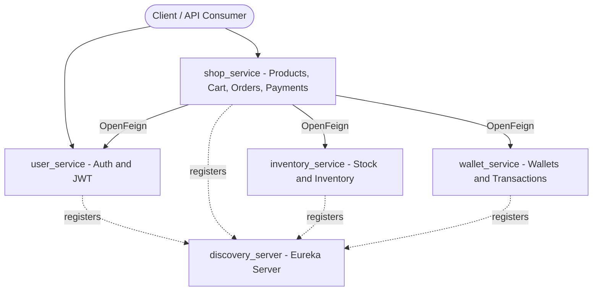

# E-Commerce Backend

A microservices-based e-commerce backend built with **Spring Boot** and **Spring Cloud**, featuring JWT authentication, service discovery, and inter-service communication across independently deployable services for users, shopping, inventory, and wallets.

<!-- TODO: confirm and update the badge versions to match your pom.xml -->


---

## Overview

This project implements the backend for an online store as a set of loosely coupled microservices. Each service owns its own domain and database, registers itself with a central **Eureka** discovery server, and communicates with other services through **OpenFeign** clients. Authentication is handled with **JWT**, and the codebase is organized as a multi-module Maven project with a shared `common` module for cross-cutting concerns.

- **~36 REST endpoints** across authentication, products, cart/checkout, orders, payments, inventory, wallets, and transactions
- **Service discovery** via Eureka so services find each other by name instead of hard-coded hosts
- **Declarative inter-service calls** via OpenFeign
- **Persistence** with Spring Data JPA and MySQL

---

## Architecture



<!-- TODO: if the real call graph differs (e.g. shop does not call user), adjust the arrows above -->

---

## Services

| Module | Responsibility | Port |
| --- | --- | --- |
| `discovery_server` | Eureka service registry; all services register here | `8761` |
| `user_service` | User registration, login, JWT issuing and validation | `<TODO>` |
| `shop_service` | Products, cart, checkout, orders, payments | `<TODO>` |
| `inventory_service` | Stock levels and inventory management | `<TODO>` |
| `wallet_service` | User wallets, balances, transactions | `<TODO>` |
| `common` | Shared DTOs, exceptions, and utilities used across services | — (library) |

<!-- TODO: fill in the actual ports from each service's application.properties / application.yml -->

---

## Tech Stack

- **Language:** Java 17 <!-- TODO: confirm version -->
- **Frameworks:** Spring Boot, Spring Web, Spring Data JPA, Spring Security
- **Spring Cloud:** Netflix Eureka (discovery), OpenFeign (inter-service calls)
- **Auth:** JWT
- **Database:** MySQL <!-- TODO: confirm; note if each service has its own schema -->
- **Build:** Maven (multi-module) with Maven Wrapper

---

## Getting Started

### Prerequisites

- JDK 17+ <!-- TODO: confirm -->
- MySQL running locally <!-- TODO: confirm connection details below -->
- Git

You do **not** need Maven installed — the project ships with the Maven Wrapper (`mvnw`).

### 1. Clone

```bash
git clone https://github.com/Omar-26/E_Commerce_Backend.git
cd E_Commerce_Backend
```

### 2. Configure the database

Create the required database(s) in MySQL and update the credentials in each service's `application.properties`:

```properties
# example - update per service
spring.datasource.url=jdbc:mysql://localhost:3306/<db_name>
spring.datasource.username=<your_username>
spring.datasource.password=<your_password>
```

<!-- TODO: list the exact database name(s) each service expects -->

### 3. Build all modules

```bash
./mvnw clean install
```

### 4. Run the services

Start the **discovery server first**, then the rest (order matters so services can register):

```bash
# 1. Discovery server (Eureka)
./mvnw spring-boot:run -pl discovery_server

# 2. Then, in separate terminals:
./mvnw spring-boot:run -pl user_service
./mvnw spring-boot:run -pl shop_service
./mvnw spring-boot:run -pl inventory_service
./mvnw spring-boot:run -pl wallet_service
```

Once running, the Eureka dashboard is available at `http://localhost:8761`.

---

## API Documentation

<!-- TODO: pick ONE of the following and delete the other -->

**Option A — Postman:** Import the collection here: `<link to your Postman collection>`

**Option B — Swagger / OpenAPI:** Add `springdoc-openapi` to each service and link the UIs, e.g. `http://localhost:<port>/swagger-ui.html`

A quick sample of the available endpoints:

| Method | Endpoint | Service | Description |
| --- | --- | --- | --- |
| `POST` | `/api/auth/register` | user_service | Register a new user |
| `POST` | `/api/auth/login` | user_service | Authenticate and receive a JWT |
| `GET`  | `/api/products` | shop_service | List products |
| `POST` | `/api/cart/checkout` | shop_service | Checkout the current cart |
| `GET`  | `/api/wallet/balance` | wallet_service | Get wallet balance |

<!-- TODO: replace the rows above with your real endpoint paths -->

---

## Project Structure

```
E_Commerce_Backend/
├── common/              # Shared DTOs, exceptions, utilities
├── discovery_server/    # Eureka service registry
├── user_service/        # Authentication + JWT, users
├── shop_service/        # Products, cart, orders, payments
├── inventory_service/   # Stock and inventory
├── wallet_service/      # Wallets and transactions
├── mvnw / mvnw.cmd      # Maven wrapper
└── pom.xml              # Parent (aggregator) POM
```

---

## Roadmap

Planned improvements that would round out the system:

- [ ] API Gateway (Spring Cloud Gateway) as a single entry point with centralized auth
- [ ] Dockerfile per service + a `docker-compose.yml` to run the whole stack with one command
- [ ] Centralized configuration (Spring Cloud Config)
- [ ] CI pipeline (GitHub Actions) running the test suite on each push
- [ ] Swagger/OpenAPI docs per service

---

## Author

**Omar Ashraf** — Software Engineer
[GitHub](https://github.com/Omar-26) · [LinkedIn](https://www.linkedin.com/in/omar-ashraf01)
